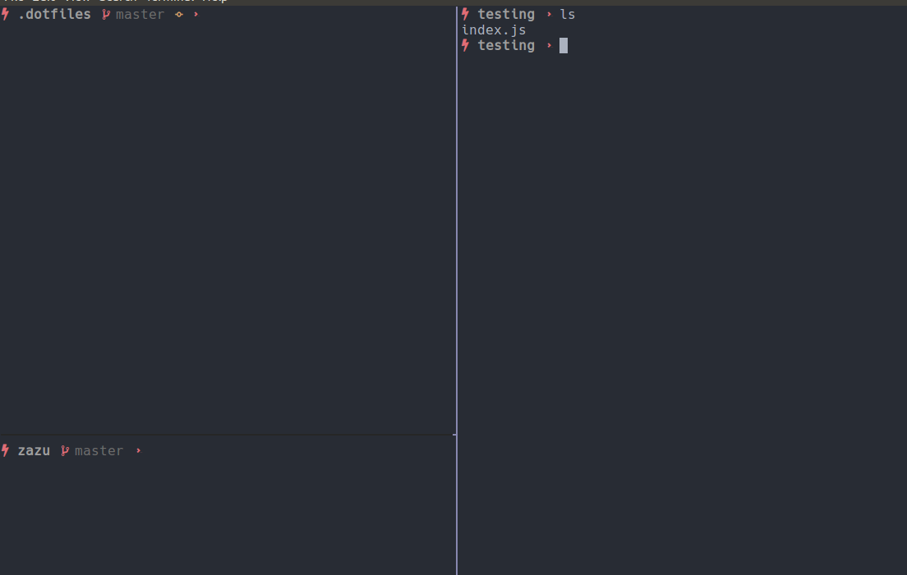

# Thunder oh-my-zsh theme

[Oh-my-zsh](https://github.com/robbyrussell/oh-my-zsh) theme using nerd fonts to render icons.

## Installing Theme

Download the [theme file]() to your custom themes in oh-my-zsh. You can [follow the 
instructions](https://github.com/robbyrussell/oh-my-zsh/wiki/Customization#overriding-and-adding-themes).

## License

Licensed under <a href="http://krolow.mit-license.org/">The MIT License</a>
Redistributions of files must retain the above copyright notice.

## Author

Vinícius Krolow - krolow[at]gmail.com
